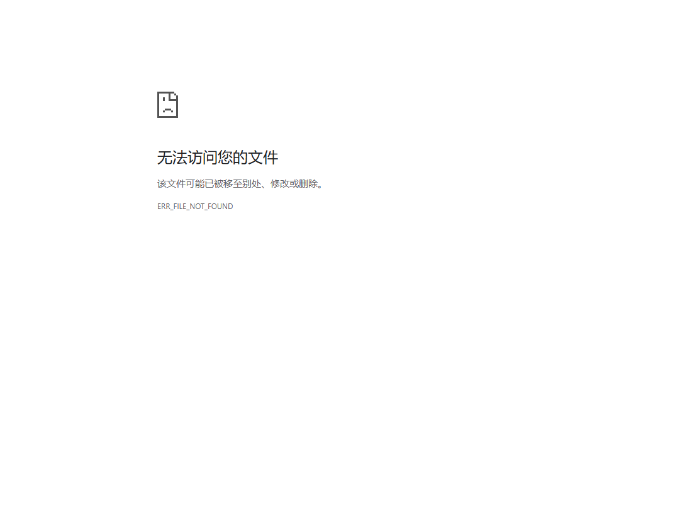

# gutenberg-reader

把 Project Gutenberg 的纯文本电子书，变成干净、离线、自包含的阅读页。

```bash
gutenberg-reader get 51828 -o books/聊斋志异 --simplify
# → books/聊斋志异/{source.txt, reader.html, reader.md}
```

`reader.html` 是**单文件、零外部依赖**——正文全部内嵌，没有 CSS 文件、没有脚本文件、没有网络请求。
双击就能看，也能塞进任何侧边栏或 iframe。



*今古奇观（80 卷 / 92 万字）的生成结果。配色由 `--theme dsh` 自动读取宿主程序当前皮肤得到。*

## 文档

| 文档 | 内容 |
| --- | --- |
| [静默失败：四个不报错的 bug](docs/silent-failures.md) | **建议先读这个**。为什么这四类 bug 全都不会报错，以及怎么防 |
| [中文排版差异实录](docs/layout-zoo.md) | 九本书的完整实测数据：7 种标题格式、3 种分段约定、繁简缺口清单 |

---

## 为什么值得写

"把文本转成 HTML"听起来是个半小时的活。它变成一周的活，是因为
**Gutenberg 的中文转写之间互不一致**——而且不一致的方式不会报错。

在同一个档案库的九本书里，我实测到：

**四种章标题格式**（都出现在三言二拍里）：

```
第一卷　蔣興哥重會珍珠衫              第 + 数字 + 卷，标题用空格隔开
第一卷轉運漢遇巧洞庭紅　波斯胡指破鼉龍殼   第 + 数字 + 卷，标题直接连写
第一卷 / 兩縣令競義婚孤女              卷标记和标题分成两行
卷一 進香客莽看金剛經 出獄僧巧完法會分    没有"第"字，标题用空格隔开
德行第一                             世說新語：篇名在数字「前」面
〈考城隍〉                           聊齋志異：标题用 CJK 书名号
1.                                  世說新語：裸条目号
```

**三种分段约定**：

| 约定 | 例子 | 特征 |
| --- | --- | --- |
| 空行分段 | 聊齋志異、世說新語 | 2,305 个空行 / 2,291 行正文 |
| **行首缩进** | 醒世恒言、喻世明言、警世通言、初刻/二刻拍案惊奇、今古奇观 | 醒世恒言有 **3,250 个缩进行，却只有 118 个空行** |
| 硬换行 | 二刻拍案惊奇 `#24162` | 每行 28 字、**每行后面都插空行**（10,334 个空行） |

### 最坑的一个：缩进是隐形的

中文排版惯例是**段首缩进、续行不缩进**：

```
'　　這首詞名為《西匯月》，是動人安分守己…'   ← 2 个全角空格 = 新段落
'色、財、气四宇，損卻精神，虧了行止…'        ← 没有缩进 = 上一段的续行
```

任何在判断之前先对每行调用 `str.strip()` 的实现，**都已经把这个信号扔掉了**。
我第一版就是这么写的，后果是：

```
初刻拍案惊奇    40 卷  →  42 段（平均每段近一万字）
```

没有报错，没有警告，就是整章塌成一段。这个 bug 就是这个库存在的理由。

---

## 第二个发现：一个"98% 正确"的 API 怎么骗过你

繁体转简体在 Windows 上是一次 API 调用（`LCMapStringW` + `LCMAP_SIMPLIFIED_CHINESE`）。
拿 100 个高频繁体字测，它得 **98 分**。

问题在那 2%。

在聊齋志異（487,759 字）上，它**静默漏掉 11 个字、共 4,800 处**——包括出现
**2,052 次**的 `爲`。它能正确转换 `為 → 为`（464 处），却完全不管异体字 `爲`。

结果是既不繁也不简的**混合文本**，比纯繁体更难读。这个失败模式危险的地方在于
**它看起来像成功**。

缺口分两类，第二类是我漏掉过的：

| 类型 | 表现 | 只映射繁体的补丁能修吗 |
| --- | --- | --- |
| 原样不动 | `爲 → 爲` | ✅ 能 |
| **转成错的变体** | `鍾 → 锺`（而非 `钟`） | ❌ **不能**——源字已经没了 |

第二类必须**再针对引擎的输出映射一次**。这个 bug 是测试抓出来的，不是我看出来的：

```
FAIL: test_every_patch_entry_converts (trad='鍾')
AssertionError: '钟' not found in 'x锺y'
```

两个我**故意不修**的字，因为无脑转换会引入错误而不是消除错误：

- `藉`（53 处）——在简体里本来就是合法字（慰藉 / 狼藉），只有「藉口 → 借口」该转，依赖上下文
- `祗`（7 处）——与 `祇`/`只` 混用的细微变体，频率可忽略

细节记录在 [`docs/layout-zoo.md`](docs/layout-zoo.md)，
排查过程与防护方法在 [`docs/silent-failures.md`](docs/silent-failures.md)。

---

## 安装与使用

```bash
# 无需安装即可跑测试（零依赖）
python run_tests.py

# 安装
pip install -e .
```

```bash
# 下载 + 构建，一步到位
gutenberg-reader get 51828 -o books/聊斋志异 --simplify

# 只下载（带完整性校验和断点续传）
gutenberg-reader fetch 51828 -o books/聊斋志异

# 从本地文本构建
gutenberg-reader build books/聊斋志异/source.txt -o books/聊斋志异 --simplify

# 生成某语言的可浏览书目
gutenberg-reader catalog --lang zh -o books/catalog.md

# 搜索
gutenberg-reader search "聊齋"
```

常用参数：

| 参数 | 作用 |
| --- | --- |
| `--simplify` | 繁体转简体（含缺口修补） |
| `--mode auto\|indent\|unwrap\|blank` | 分段模式，默认自动探测 |
| `--theme plain\|dark\|light\|dsh` | 配色方案，默认 `plain` |
| `--fs N` | 基准字号，默认 15px |
| `--title T` | 页面标题（也决定宿主标签页显示的名字） |

阅读页自带：滚动位置记忆、字号记忆（`+`/`-` 调整后**永久生效**）、
键盘翻页（`空格`/`j`/`k`/`d`/`u`/`g`/`G`）、自动深色模式。

---

## 下载器的完整性校验

这个也值得单独说，因为它差点让我发出一本残书。

最朴素的下载循环有个比崩溃更糟的失败模式：连接中断时 `read()` 返回空，
**循环正常结束**，残缺文件被当成完整的发布出去。

在一条 0.02 MB/s 的慢链路上实测，六个文件里**四个被静默截断**：

| 书 | 应有 | 实收 | |
| --- | --- | --- | --- |
| 警世通言 | 1,176,833 | 1,176,833 | ok |
| 喻世明言 | 1,130,409 | 1,119,627 | 残 |
| 醒世恒言 | 1,651,633 | 1,168,587 | 残（71%） |
| 初刻拍案惊奇 | 1,213,458 | 1,091,067 | 残 |
| 二刻拍案惊奇 | 968,635 | 813,628 | 残 |
| **今古奇观** | **2,896,630** | **724,887** | **残（25%）** |

四分之一本书，被当作成功。

所以 `fetch` 会：**校验**字节数并对不上就拒绝发布；用 `Range` **续传**而不是从头再来；
**重试** 5 次并退避。续传不是理论上的：今古奇观实际用了 4 次（失败于 17%、37%、99.6%），
醒世恒言 3 次（62.8%、99.0%）。

---

## 测试

**40 个测试，零第三方依赖**（stdlib `unittest`），任何人都能立刻跑：

```bash
python run_tests.py     # 或 python -m unittest discover -s tests -v
```

每个测试用例都对应一本真实书里踩过的坑，docstring 会说明是哪一本、哪个版本。
这比"覆盖率 100%"更有用：它记录的是**行为**，不是行数。

重构后的库还拿九本真实书跟已验证的原始流程做了逐项对比，标题数、条目数、
段落密度全部一致（`mismatches: 0`）。

---

## 项目结构

```
src/gutenberg_reader/
├── structure.py    ★ 解析引擎：7 种标题格式、3 种分段模式
├── simplify.py     ★ 繁转简 + 两类缺口修补
├── fetch.py          完整性校验 + 断点续传下载
├── catalog.py        Gutenberg 书目与搜索
├── render.py         自包含 HTML / Markdown 输出
├── theme.py          配色 provider（plain 默认，dsh 为宿主主题适配示例）
└── cli.py            命令行入口
```

`structure.py` 和 `simplify.py` 是核心，其余都是外围。

---

## 已知限制

诚实列出来，因为它们都是真实取舍：

1. **繁体转简体的质量取决于引擎**。Windows 上走 `LCMapStringW`，其它平台回退到
   OpenCC（若已安装）。两者都不可用时，仍会应用补丁表——不是零转换，但覆盖率有限。
   补丁表是按聊齋志異校准的，换书可以用 `audit_gaps()` 重新校准。
2. **短行启发式会有良性误判**。二刻拍案惊奇里有 2 个词牌名（`满江红`、`如梦令`）
   被识别成标题。渲染出来正好给词做了标注，未做处理。
3. **下载只面向 Project Gutenberg**。不包含也不支持任何盗版书源。
4. **只处理纯文本**。EPUB / MOBI / PDF 不在范围内（需要的话请用 Calibre）。
5. **`theme.py` 的 `dsh` provider 读取特定宿主程序的磁盘配置**，属于示例而非稳定接口；
   宿主目录结构变化会使其回退到 `plain`，不会报错。

---

## 版权

本工具**只获取 Project Gutenberg 上的公版书**，不含任何正版书源。
生成的阅读页内容版权归属各自的权利人；本仓库**不附带任何书籍正文**。

代码以 [MIT](LICENSE) 许可发布。

---

## English summary

`gutenberg-reader` turns Project Gutenberg plain-text books into self-contained
offline reading pages.

The interesting part is not the rendering — it is that Gutenberg's Chinese
transcriptions disagree with each other about structure. Across nine books this
project found **four chapter-heading layouts and three paragraph-boundary
conventions**, and the failures are silent: a parser that only handles the
layout you happened to see first collapses 40 chapters into 42 paragraphs with
no error.

Two documented findings drive the design:

- **Paragraph boundaries are often marked by indentation alone.** 醒世恒言 has
  3,250 indented lines and only 118 blank lines. Any implementation that calls
  `str.strip()` before deciding what a line is has already discarded the signal.
- **The OS Traditional→Simplified API scores 98/100 and cannot be trusted.**
  On 聊齋志異 it silently leaves 11 forms behind (4,800 occurrences, including
  `爲` 2,052 times), producing a mixed-script document. It also sometimes emits
  the *wrong variant*, which a patch table keyed on Traditional sources cannot
  repair — that bug was found by a test, not by reading.

40 tests, standard library only: `python run_tests.py`.
